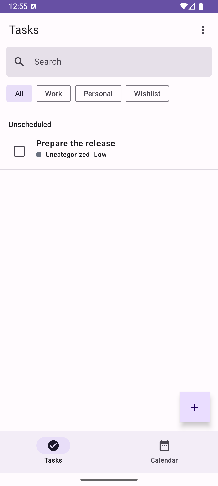
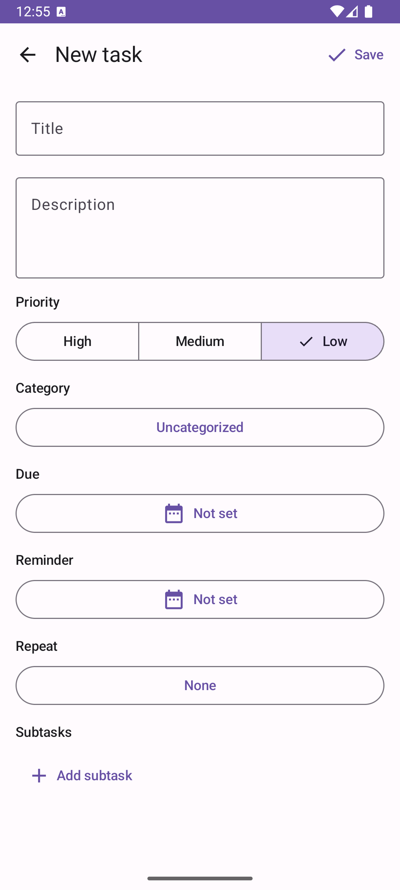
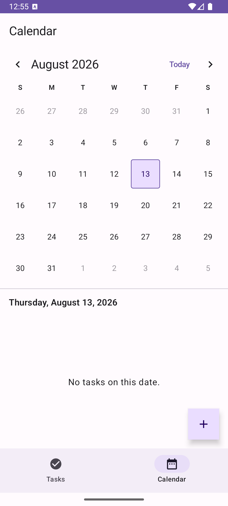
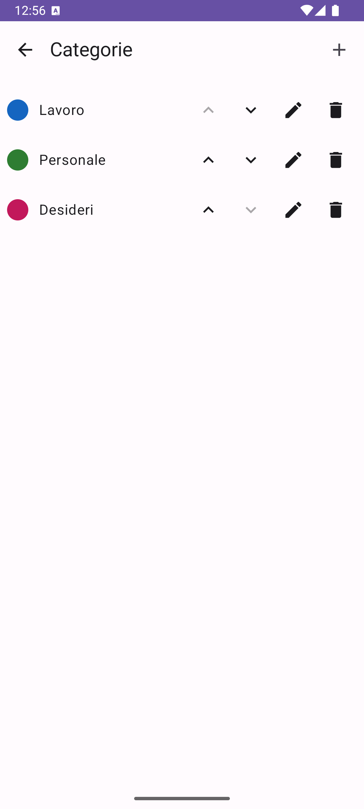
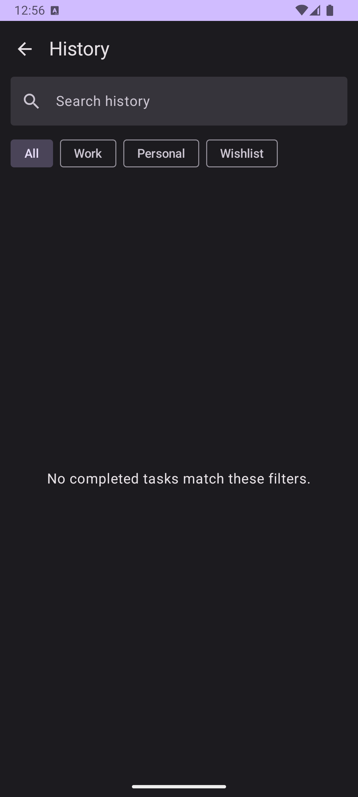

# Now Do This

Now Do This is a local-first Android task manager built with Kotlin and Jetpack Compose. It supports task and subtask completion, categories, priorities, due dates, one reminder, recurrence, Calendar planning, completion History, and Android-native per-app language selection. Italian is the primary language and English is included.

## Product

| Task list | Task editor | Calendar |
| --- | --- | --- |
|  |  |  |

| Categories | History |
| --- | --- |
|  |  |

Core workflows include grouped pending tasks, completion and recurring occurrence generation, user-managed categories, task search and sorting, swipe-delete undo, a monthly Calendar, and searchable read-only completion History.

## Architectural Highlights

- Single `:app` production module with feature-first packages for `task`, `category`, `calendar`, and `history`.
- Clean MVVM boundaries: Compose UI, ViewModel, reusable use cases, domain repository contracts, and offline implementations.
- Unidirectional data flow with immutable UI state, UI events, `StateFlow`, and one-off effect flows.
- Local-first persistence with Room and DataStore; no account, backend, analytics SDK, or network synchronization.
- Hilt dependency injection and coroutines/Flow across asynchronous boundaries.
- Navigation 3 with serializable navigation keys and lifecycle-aware ViewModel stores.

The [architecture index](docs/architecture/README.md) links system context, data flow, platform boundaries, ADRs, and objective triggers for future modularization.

## Data And UDF Flow

Compose screens emit typed events to ViewModels. ViewModels reduce repository and use-case flows into immutable screen state; repositories coordinate Room, DataStore, and Android platform adapters. Reusable business invariants and cross-boundary workflows live in use cases, while screen-specific orchestration remains in ViewModels.

See the [documented UDF flow](docs/architecture/data-flow.md) and [Clean MVVM decision](docs/architecture/adr/0003-clean-mvvm-and-udf.md).

## Android Platform Depth

- Room schema exports, explicit migrations, DAO/transaction instrumentation tests, and forward-only migration policy.
- AlarmManager reminders with exact-alarm capability fallback, notification permission handling, boot/startup reconciliation, and editor deep links.
- Android-native per-app locale selection with generated locale configuration.
- Accessibility semantics for roles, selected/toggle states, localized spoken descriptions, and minimum interactive targets.
- R8 optimization, resource shrinking, optional environment-based release signing, mapping artifacts, and packaged Baseline Profile.

## Quality And Performance Evidence

Pull requests and pushes to `develop` run compilation, JVM tests, lint, and debug assembly through [Android quality CI](.github/workflows/android-quality.yml). The repository also contains:

- [Test strategy](docs/quality/test-strategy.md)
- [Verification matrix](docs/quality/verification-matrix.md)
- [Accessibility checklist](docs/quality/accessibility-checklist.md)
- [Macrobenchmark and Baseline Profile procedure](docs/performance/README.md)
- [Emulator performance results](docs/performance/results-2026-08.md)
- [Release checklist](docs/release/checklist.md)

Recorded emulator measurements validate repeatable benchmark infrastructure but are not presented as physical-device performance claims.

## Build And Run

Use JDK 17 and an Android SDK with API 36 installed.

```bash
./gradlew :app:compileDebugKotlin :app:testDebugUnitTest :app:lintDebug :app:assembleDebug
./gradlew :app:connectedDebugAndroidTest
./gradlew :app:assembleRelease :app:bundleRelease
```

The release build remains unsigned unless all four `NOWDOTHIS_*` signing variables documented in [release discipline](docs/release/README.md) are supplied.

## Trade-offs And Revisit Triggers

The single production module is deliberate for the current team size and domain. A new Gradle module requires separate ownership, enforceable dependency isolation, reusable infrastructure, isolated build/testing, or measured build-time benefit. Local-first storage avoids account and synchronization complexity, but currently provides no cross-device access or user-owned backup.

The ADRs record rejected alternatives and concrete revisit triggers rather than treating current choices as permanent.

## Roadmap

Product-value work is intentionally separate from this readiness branch. Candidate investments include backup/restore, widgets, richer recurrence, faster capture, and improved planning workflows. KMP/iOS remains deferred until product behavior and shared-domain value justify the additional platform and architecture cost.
