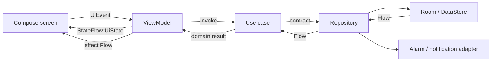

# Clean MVVM And UDF Data Flow

The diagram below is the use-case path for multi-step workflows such as `SaveTask`;
it is not a mandatory hop for every interaction. ViewModels may instead consume
domain repository contracts directly for simple reads, mutations, and screen
coordination. Both paths keep data and platform implementations behind domain-owned
contracts.

The diagram groups domain-facing persistence and platform contracts at the
repository boundary. In the concrete save path, `SaveTask` depends separately on
`TaskRepository` and `ReminderScheduler`; their implementations still remain outside
the domain use case.

## Dependency Policy

- Use a domain use case when a workflow coordinates multiple operations or contracts,
  enforces reusable domain rules, or benefits from isolated workflow tests.
- A ViewModel may call a domain repository contract directly for a simple read,
  mutation, or screen-coordination concern that does not contain a multi-step domain
  workflow.
- A ViewModel does not depend on a repository implementation, Room, DataStore,
  AlarmManager, or notification framework APIs.

For example, `TaskListViewModel` invokes task lifecycle use cases while directly
observing `CategoryRepository` and `TaskPreferencesRepository` for screen data and
sort coordination. `TaskEditorViewModel` reads tasks and categories through their
repository contracts, then invokes `SaveTask` for validation, persistence, and
reminder scheduling.

## State

State is the durable description of what a screen should render. For example,
`TaskListViewModel.uiState` combines task sections, categories, the DataStore-backed
sort preference, the active filter, loading and error state, and confirmation state
into an immutable `StateFlow<TaskListUiState>`. `TaskListRoute` collects it with
lifecycle awareness and passes the value to the stateless `TaskListScreen`.

Observable data returns through `Flow`: `TaskRepository.observeSections` is
implemented by `OfflineTaskRepository`, which maps Room DAO emissions into domain
tasks and classified sections before the ViewModel builds UI state.

## Events

Events describe user intent and enter a screen through one dispatch point. The task
list sends `TaskListEvent` values to `TaskListViewModel.onEvent`. The ViewModel may
update local state, call a domain repository contract for simple screen work, or
invoke a use case for a multi-step workflow; the Composable does not call Room or a
repository implementation directly.

For a write example, the editor invokes `SaveTask`. The use case validates the domain
model, calls the `TaskRepository` contract, and coordinates the domain-owned
`ReminderScheduler` contract. `OfflineTaskRepository` fulfills the persistence call
with Room transactions, while the reminder implementation delegates to the Android
alarm adapter and writes the resulting reminder status back through the repository.

## Effects

Effects are one-time outcomes that should not become durable render state, such as
opening a destination, requesting notification permission, or showing a snackbar.
`TaskListViewModel.effects` exposes a `Flow<TaskListEffect>` backed by a buffered
channel. `TaskListRoute` collects that flow and translates each effect into UI or
navigation work. This keeps Android and Compose actions out of the ViewModel while
leaving persistent screen content in `UiState`.

## Dependency Ownership

- Presentation owns Compose screens, contracts, ViewModels, screen coordination, and
  route-level effect handling. ViewModels may consume domain contracts under the
  dependency policy above.
- Domain owns models, multi-step use cases such as `SaveTask`, and contracts such as
  `TaskRepository` and `ReminderScheduler`.
- Data owns `OfflineTaskRepository`, DataStore-backed preferences, Room entities,
  DAOs, and mapping between persistence and domain models.
- App and core packages own composition, Navigation 3, database construction,
  notifications, alarms, time, and shared design primitives.
