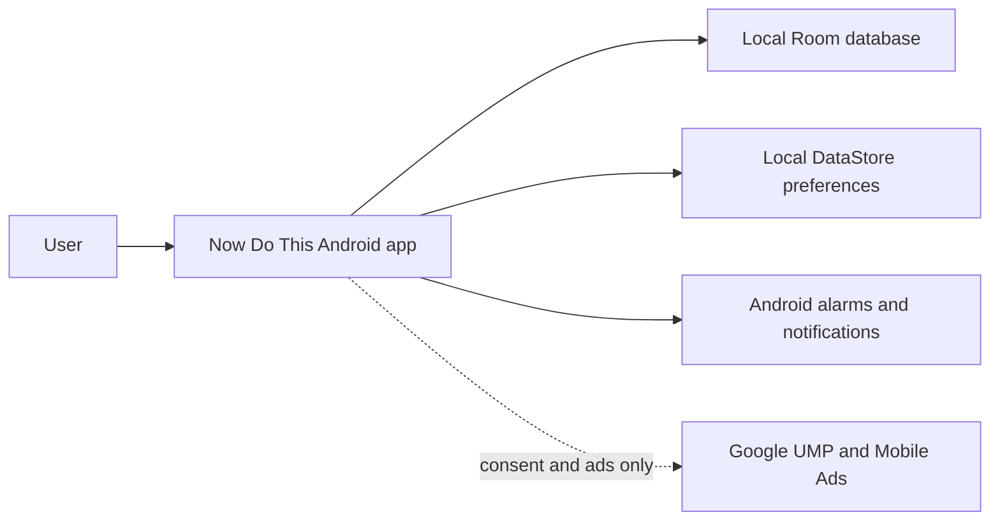

# System Context

Now Do This is a local-first Android task manager. The user interacts with one
installed application; the application persists planning data and preferences locally,
uses Android system services for reminder delivery, and accesses Google consent and ad
services only for the consent-gated advertising surface.

## Responsibilities

- **Now Do This Android app:** renders the Compose UI, applies domain rules, and
  coordinates persistence and Android platform adapters.
- **Local Room database:** stores tasks, subtasks, categories, completion history,
  and reminder status as the durable source of truth.
- **Local DataStore preferences:** stores task-list sort preferences that can be
  observed as a `Flow`.
- **Android alarms and notifications:** schedule local reminder delivery, apply the
  exact-alarm fallback, publish notifications, and route reminder taps back into the
  app.
- **Google UMP and Mobile Ads:** obtain applicable privacy choices and request a test
  banner only when UMP reports that ads may be requested. This boundary receives no
  task, category, reminder, history, or backup content.

## System Boundary

There is no account, application backend, analytics SDK, or network synchronization.
The application remains usable without connectivity; only consent messages and ads
depend on Google services. Device transfer, cross-device collaboration, and remote
recovery are not responsibilities of the current system.
