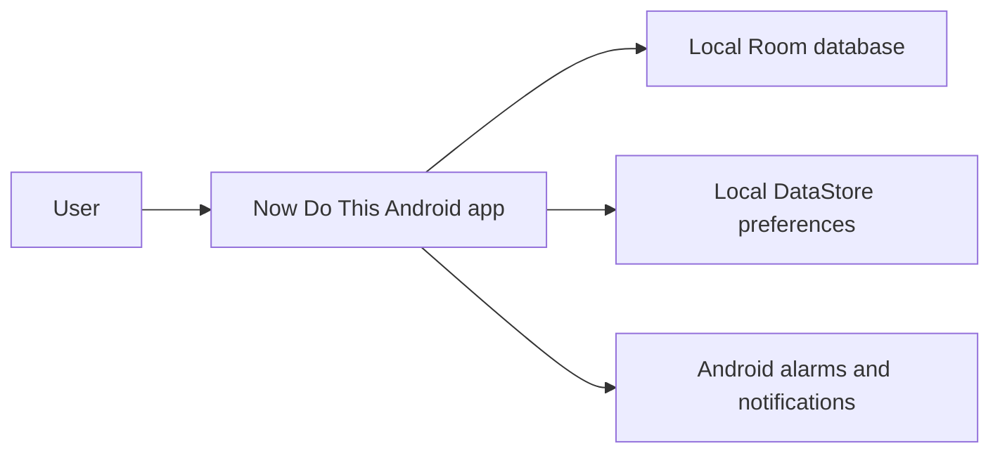

# System Context

Now Do This is a private, offline Android task manager. The user interacts with one
installed application; the application persists data and preferences locally and
uses Android system services for reminder delivery.

## Responsibilities

- **Now Do This Android app:** renders the Compose UI, applies domain rules, and
  coordinates persistence and Android platform adapters.
- **Local Room database:** stores tasks, subtasks, categories, completion history,
  and reminder status as the durable source of truth.
- **Local DataStore preferences:** stores task-list sort preferences that can be
  observed as a `Flow`.
- **Android alarms and notifications:** schedule local reminder delivery, apply the
  exact-alarm fallback, publish notifications, and route reminder taps back into the
  app.

## System Boundary

There is no account, backend, analytics SDK, or network synchronization outside this
context. The application remains usable without connectivity. Device transfer,
cross-device collaboration, and remote recovery are not responsibilities of the
current system.
