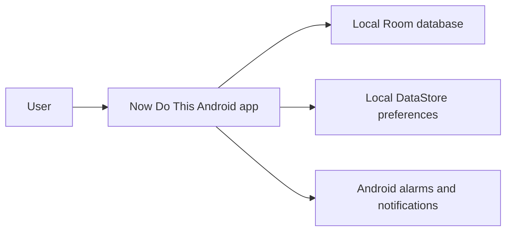
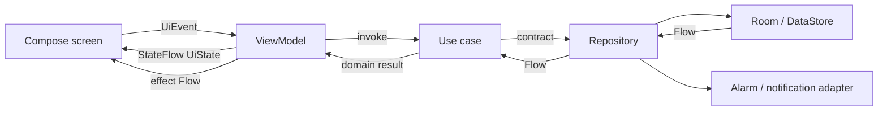

# Production Readiness Implementation Plan

> **For agentic workers:** REQUIRED SUB-SKILL: Use superpowers:subagent-driven-development (recommended) or superpowers:executing-plans to implement this plan task-by-task. Steps use checkbox (`- [ ]`) syntax for tracking.

**Goal:** Make Now Do This demonstrably measurable, repeatable, accessible, releasable, and interview-ready without broad modularization or new product features.

**Architecture:** Preserve the existing single-module, feature-first Clean MVVM implementation. Add documentation and delivery controls around it, plus one purpose-built `:benchmark` test module whose only responsibility is Baseline Profile generation and repeatable macrobenchmarks.

**Tech Stack:** Kotlin 2.2.21, Android Gradle Plugin 8.13.1, Jetpack Compose, Room, Hilt, GitHub Actions, Android Lint, Macrobenchmark 1.4.1, Baseline Profile Gradle plugin, Profile Installer 1.4.1, UI Automator, R8.

## Global Constraints

- Production Readiness is implemented on `feature/production-readiness`, created from commit `8f0015e` or its direct successor containing only approved documentation.
- Do not begin backup/restore, widgets, natural-language capture, advanced recurrence, KMP, iOS, synchronization, or broad Gradle modularization in this branch.
- Product Value starts only after the Production Readiness definition of done is verified and reported to the user; it must use a new branch from the verified Production Readiness tip.
- Keep the application local-first and preserve all existing Room data and migration behavior.
- Do not introduce SonarQube, remote build infrastructure, mandatory percentage coverage, automated Play deployment, Detekt, or Ktlint in this program.
- Run JVM tests before each commit that changes production code; run the complete final verification matrix before declaring the program complete.
- Benchmark numbers must name the device, API level, build variant, compilation mode, iteration count, and date. Never compare measurements from different devices as before/after evidence.
- Codex usage cannot be read from the account. Track completion by the six phases in the approved specification, not by inferred quota.

---

### Task 1: Architecture Evidence And Decision Records

**Files:**
- Create: `docs/architecture/README.md`
- Create: `docs/architecture/system-context.md`
- Create: `docs/architecture/data-flow.md`
- Create: `docs/architecture/adr/0001-local-first.md`
- Create: `docs/architecture/adr/0002-single-module-feature-first.md`
- Create: `docs/architecture/adr/0003-clean-mvvm-and-udf.md`
- Create: `docs/architecture/adr/0004-platform-boundaries.md`
- Modify: `README.md`

**Interfaces:**
- Consumes: Current package structure under `app/src/main/java/com/indiewalkabout/nowdothis` and the approved design specification.
- Produces: Stable documentation entry point `docs/architecture/README.md`, ADR status vocabulary `Accepted | Superseded`, and objective modularization triggers referenced by the portfolio README.

- [ ] **Step 1: Capture the current dependency evidence**

Run:

```bash
rg -n '^package |^import com\.indiewalkabout\.nowdothis' app/src/main/java > /tmp/nowdothis-packages.txt
find app/src/main/java/com/indiewalkabout/nowdothis -maxdepth 4 -type d | sort
```

Expected: packages exist for `app`, `core`, and the `task`, `category`, `calendar`, and `history` features; no Gradle feature modules exist.

- [ ] **Step 2: Write the architecture index and system context**

Use Mermaid in `docs/architecture/system-context.md`:



`docs/architecture/README.md` must link every architecture document and state that the app has no account, backend, analytics SDK, or network synchronization.

- [ ] **Step 3: Document the Clean MVVM and UDF flow**

Use this dependency model in `docs/architecture/data-flow.md`:



Describe state, events, and effects separately. Reference concrete examples: `TaskListViewModel`, `SaveTask`, `TaskRepository`, and `OfflineTaskRepository`.

- [ ] **Step 4: Write the four ADRs**

Each ADR must use:

```markdown
# ADR NNNN: Decision

- Status: Accepted
- Date: 2026-08-12

## Context
## Decision
## Consequences
## Rejected Alternatives
## Revisit When
```

ADR 0002 must state that a new module requires at least one of: separate ownership, enforceable dependency isolation, reusable infrastructure, isolated build/testing, or measured build-time benefit. ADR 0004 must identify Room, DataStore, AlarmManager, notifications, locale selection, and Navigation 3 as platform or framework boundaries.

- [ ] **Step 5: Add the architecture entry point to README**

Add a concise `Architecture` section linking `docs/architecture/README.md`. Do not rewrite the final portfolio README yet.

- [ ] **Step 6: Verify documentation integrity**

Run:

```bash
rg -n 'TBD|TODO|implement later' docs/architecture README.md
git diff --check
```

Expected: the first command returns no matches and `git diff --check` exits zero.

- [ ] **Step 7: Commit**

```bash
git add README.md docs/architecture
git commit -m "docs: record architecture decisions"
```

---

### Task 2: Minimal Pull-Request Quality Gates

**Files:**
- Create: `.github/workflows/android-quality.yml`
- Create: `.github/dependabot.yml`
- Create: `.github/pull_request_template.md`
- Modify: `README.md`

**Interfaces:**
- Consumes: Gradle wrapper and existing `:app` verification tasks.
- Produces: Required local/CI command `./gradlew :app:compileDebugKotlin :app:testDebugUnitTest :app:lintDebug :app:assembleDebug` and downloadable reports under the workflow artifact `android-quality-reports`.

- [ ] **Step 1: Prove the intended gate locally**

Run:

```bash
./gradlew :app:compileDebugKotlin :app:testDebugUnitTest :app:lintDebug :app:assembleDebug
```

Expected: `BUILD SUCCESSFUL`. If lint fails, fix actionable defects; create a lint baseline only for confirmed legacy findings and explain each accepted category in the commit.

- [ ] **Step 2: Add the GitHub Actions workflow**

Create `.github/workflows/android-quality.yml` with:

```yaml
name: Android quality

on:
  pull_request:
  push:
    branches: [develop]

permissions:
  contents: read

concurrency:
  group: android-quality-${{ github.ref }}
  cancel-in-progress: true

jobs:
  verify:
    runs-on: ubuntu-latest
    timeout-minutes: 30
    steps:
      - uses: actions/checkout@v4
      - uses: actions/setup-java@v4
        with:
          distribution: temurin
          java-version: "17"
      - uses: gradle/actions/setup-gradle@v4
      - name: Verify Android project
        run: ./gradlew :app:compileDebugKotlin :app:testDebugUnitTest :app:lintDebug :app:assembleDebug
      - name: Upload reports
        if: always()
        uses: actions/upload-artifact@v4
        with:
          name: android-quality-reports
          path: |
            app/build/reports/tests/
            app/build/reports/lint-results-debug.html
          if-no-files-found: warn
```

- [ ] **Step 3: Add dependency maintenance**

Create `.github/dependabot.yml` with monthly Gradle and GitHub Actions updates, each limited to five open pull requests.

- [ ] **Step 4: Add the pull-request checklist**

The checklist must contain explicit checks for behavior, JVM/instrumented tests, Room migration impact, reminder behavior, accessibility, localization, screenshots for UI changes, and architecture documentation.

- [ ] **Step 5: Validate workflow syntax and commands**

Run:

```bash
ruby -e 'require "yaml"; YAML.load_file(".github/workflows/android-quality.yml"); YAML.load_file(".github/dependabot.yml")'
./gradlew :app:compileDebugKotlin :app:testDebugUnitTest :app:lintDebug :app:assembleDebug
git diff --check
```

Expected: YAML parsing and Gradle verification succeed.

- [ ] **Step 6: Commit**

```bash
git add .github README.md
git commit -m "ci: add Android quality gates"
```

---

### Task 3: Benchmark And Baseline Profile Infrastructure

**Files:**
- Modify: `settings.gradle.kts`
- Modify: `build.gradle.kts`
- Modify: `app/build.gradle.kts`
- Create: `benchmark/build.gradle.kts`
- Create: `benchmark/src/main/AndroidManifest.xml`
- Create: `benchmark/src/main/java/com/indiewalkabout/nowdothis/benchmark/CriticalUserJourneys.kt`
- Create: `benchmark/src/main/java/com/indiewalkabout/nowdothis/benchmark/BaselineProfileGenerator.kt`
- Create: `benchmark/src/main/java/com/indiewalkabout/nowdothis/benchmark/StartupBenchmark.kt`
- Create: `benchmark/src/main/java/com/indiewalkabout/nowdothis/benchmark/TaskListBenchmark.kt`
- Create: `docs/performance/README.md`
- Create after measurement: `docs/performance/results-2026-08.md`

**Interfaces:**
- Consumes: Package `com.indiewalkabout.nowdothis`, launcher activity, stable Compose semantics/content descriptions, and a connected API 33+ physical device.
- Produces: `:benchmark` test module, `:app:generateBaselineProfile`, startup and list-scroll benchmark results, and generated Baseline Profile consumed by release builds.

- [ ] **Step 1: Add supported benchmark plugins and dependencies**

Add to root plugins:

```kotlin
id("com.android.test") version "8.13.1" apply false
id("androidx.baselineprofile") version "1.4.1" apply false
```

Include `:benchmark` in `settings.gradle.kts`. Apply `androidx.baselineprofile` to `:app`, add `baselineProfile(project(":benchmark"))`, and add `implementation("androidx.profileinstaller:profileinstaller:1.4.1")`.

- [ ] **Step 2: Configure the benchmark module**

Use `com.android.test`, Kotlin Android, and `androidx.baselineprofile`. Set `targetProjectPath = ":app"`, namespace `com.indiewalkabout.nowdothis.benchmark`, compile SDK 36, min SDK 23, target SDK 34, Java/Kotlin 17, and runner `androidx.test.runner.AndroidJUnitRunner`. Add:

```kotlin
implementation("androidx.test.ext:junit:1.2.1")
implementation("androidx.test.uiautomator:uiautomator:2.3.0")
implementation("androidx.benchmark:benchmark-macro-junit4:1.4.1")
```

Configure `baselineProfile { useConnectedDevices = true }`. Do not add a managed-device image download to pull-request CI.

- [ ] **Step 3: Extract reusable critical user journeys**

`CriticalUserJourneys.kt` must provide functions with these signatures:

```kotlin
internal const val TARGET_PACKAGE = "com.indiewalkabout.nowdothis"

internal fun MacrobenchmarkScope.startFromHome()
internal fun MacrobenchmarkScope.openTaskEditor(device: UiDevice)
internal fun MacrobenchmarkScope.scrollTaskList(device: UiDevice)
```

Use resource IDs or stable semantics/content descriptions. Do not locate controls by Italian or English visible text.

- [ ] **Step 4: Add a failing benchmark compile gate**

Run before all classes are complete:

```bash
./gradlew :benchmark:compileNonMinifiedReleaseKotlin
```

Expected: FAIL because the generator and benchmark classes reference missing journey functions.

- [ ] **Step 5: Implement Baseline Profile generation**

Collect startup with `includeInStartupProfile = true`, then editor opening and task-list scrolling as critical user journeys. Reset app data before collection so the procedure is reproducible.

- [ ] **Step 6: Implement startup and scrolling macrobenchmarks**

`StartupBenchmark` must compare `CompilationMode.None()` and `CompilationMode.Partial(BaselineProfileMode.Require)` with `StartupMode.COLD`, `StartupTimingMetric()`, and at least 10 iterations. `TaskListBenchmark` must use `FrameTimingMetric()` and at least 10 iterations against the deterministic fixture described in Step 8.

- [ ] **Step 7: Verify benchmark compilation**

Run:

```bash
./gradlew :benchmark:assemble :app:assembleRelease
```

Expected: both modules assemble and the release artifact contains no test-only benchmark classes.

- [ ] **Step 8: Define deterministic benchmark data preparation**

Document and implement a debug/benchmark-only fixture entry point that inserts exactly 750 tasks with fixed IDs, dates relative to an injected fixed clock, four categories, and a repeatable priority distribution. Place implementation under `app/src/debug/`; production source sets must not expose fixture APIs.

Add an instrumentation test asserting the fixture creates 750 tasks and remains idempotent. Run it on the connected device before benchmark collection.

- [ ] **Step 9: Generate and measure on one named device**

Run on the same connected API 33+ physical device:

```bash
./gradlew :app:generateBaselineProfile
./gradlew :benchmark:connectedNonMinifiedReleaseAndroidTest \
  -Pandroid.testInstrumentationRunnerArguments.class=com.indiewalkabout.nowdothis.benchmark.StartupBenchmark
./gradlew :benchmark:connectedNonMinifiedReleaseAndroidTest \
  -Pandroid.testInstrumentationRunnerArguments.class=com.indiewalkabout.nowdothis.benchmark.TaskListBenchmark
```

Record device model, API, date, build SHA, iteration count, median startup for no compilation and Baseline Profile, and frame timing percentiles in `docs/performance/results-2026-08.md`. Store no invented target or improvement threshold.

- [ ] **Step 10: Verify the profile is packaged**

Run:

```bash
./gradlew :app:bundleRelease
unzip -l app/build/outputs/bundle/release/app-release.aab | rg 'BUNDLE-METADATA/com.android.tools.build.profiles/baseline.prof'
```

Expected: packaged `baseline.prof` is listed.

- [ ] **Step 11: Commit**

```bash
git add settings.gradle.kts build.gradle.kts app/build.gradle.kts app/src/debug benchmark docs/performance
git commit -m "perf: add measured baseline profiles"
```

---

### Task 4: Accessibility Contracts And Validation

**Files:**
- Modify: `app/src/main/java/com/indiewalkabout/nowdothis/feature/task/presentation/list/TaskListScreen.kt`
- Modify: `app/src/main/java/com/indiewalkabout/nowdothis/feature/task/presentation/list/TaskRow.kt`
- Modify: `app/src/main/java/com/indiewalkabout/nowdothis/feature/task/presentation/editor/TaskEditorScreen.kt`
- Modify: `app/src/main/java/com/indiewalkabout/nowdothis/feature/category/presentation/CategoryScreen.kt`
- Modify: `app/src/main/java/com/indiewalkabout/nowdothis/feature/calendar/presentation/CalendarScreen.kt`
- Modify: `app/src/main/java/com/indiewalkabout/nowdothis/feature/calendar/presentation/MonthGrid.kt`
- Modify: `app/src/main/java/com/indiewalkabout/nowdothis/feature/history/presentation/HistoryScreen.kt`
- Modify: `app/src/main/res/values/strings.xml`
- Modify: `app/src/main/res/values-en/strings.xml`
- Modify: existing screen tests under matching `app/src/androidTest/.../presentation/` packages
- Create: `docs/quality/accessibility-checklist.md`

**Interfaces:**
- Consumes: Existing Compose screens and localized resources.
- Produces: Stable semantic roles/state descriptions for primary controls, automated accessibility assertions, and a manual API/device matrix.

- [ ] **Step 1: Establish failing semantic assertions**

Add tests that require:

```kotlin
composeRule.onNodeWithContentDescription(localizedAddTask).assertHasClickAction()
composeRule.onNodeWithText(taskTitle).assert(SemanticsMatcher.expectValue(Role, Role.Checkbox))
composeRule.onNodeWithText(taskTitle).assertIsToggleable()
composeRule.onNodeWithContentDescription(localizedPreviousMonth).assertTouchWidthIsAtLeast(48.dp)
composeRule.onNodeWithContentDescription(localizedNextMonth).assertTouchHeightIsAtLeast(48.dp)
```

Use localized strings from the test context. Add equivalent assertions for delete, category selection, reminder state, Calendar day selection, and History inspection.

- [ ] **Step 2: Run the focused tests and confirm failure**

Run the affected test classes with `connectedDebugAndroidTest` and the runner `class` argument.

Expected: at least one assertion fails for a missing role, state description, content description, or undersized target.

- [ ] **Step 3: Implement the minimum semantic and target fixes**

Use `Modifier.semantics`, `Role`, `stateDescription`, `toggleable`, `selectable`, and `minimumInteractiveComponentSize()` only where the control's native semantics are insufficient. Put all spoken descriptions in both Italian and English resources. Do not concatenate localized spoken phrases from fragments.

- [ ] **Step 4: Add large-font layout coverage**

For Task List, Task Editor, Categories, Calendar, and History, run tests with `fontScale = 2f` through a test configuration override. Assert primary commands remain displayed and clickable and that lazy containers can scroll to the final actionable element.

- [ ] **Step 5: Verify contrast and non-color state cues manually**

Record light/dark outcomes in `docs/quality/accessibility-checklist.md`. For every priority, category selection, error, disabled action, and overdue state, document the additional icon, label, role, or state description that prevents color-only communication.

- [ ] **Step 6: Run the accessibility verification set**

Run:

```bash
./gradlew :app:connectedDebugAndroidTest \
  -Pandroid.testInstrumentationRunnerArguments.package=com.indiewalkabout.nowdothis.feature
./gradlew :app:lintDebug
```

Expected: feature Compose tests and lint pass.

- [ ] **Step 7: Perform and record TalkBack validation**

On one attached device, execute create task, complete task, delete/undo, category management, Calendar navigation, and History inspection with TalkBack enabled. Record device/API/date and pass/fail for labels, order, roles, state, and completion without sight.

- [ ] **Step 8: Commit**

```bash
git add app/src/main app/src/androidTest docs/quality/accessibility-checklist.md
git commit -m "fix: strengthen app accessibility"
```

---

### Task 5: Release Discipline And Artifact Verification

**Files:**
- Modify: `app/build.gradle.kts`
- Modify: `app/proguard-rules.pro`
- Modify: `.gitignore`
- Create: `CHANGELOG.md`
- Create: `docs/release/README.md`
- Create: `docs/release/checklist.md`
- Create: `docs/release/migration-and-rollback.md`

**Interfaces:**
- Consumes: Existing release build, Room schema exports, reminder receivers, Hilt, Kotlin Serialization, and generated Baseline Profile.
- Produces: Minified/shrunk release AAB, environment-based optional signing contract, changelog policy, and repeatable release checklist.

- [ ] **Step 1: Add a release artifact smoke test before enabling R8**

Run:

```bash
./gradlew :app:bundleRelease
test -f app/build/outputs/bundle/release/app-release.aab
```

Expected: current unminified release bundle exists.

- [ ] **Step 2: Configure release optimization and optional signing**

Set release `isMinifyEnabled = true` and `isShrinkResources = true`. Read `NOWDOTHIS_STORE_FILE`, `NOWDOTHIS_STORE_PASSWORD`, `NOWDOTHIS_KEY_ALIAS`, and `NOWDOTHIS_KEY_PASSWORD` from environment variables. Configure release signing only when all four are present; otherwise produce the unsigned release artifact without failing local verification.

Never log secret values. Add `*.jks`, `*.keystore`, and `keystore.properties` to `.gitignore`.

- [ ] **Step 3: Build the optimized release and inspect failures**

Run:

```bash
./gradlew clean :app:testDebugUnitTest :app:assembleRelease :app:bundleRelease
```

Expected: success. Add keep rules only for failures demonstrated by R8 or release smoke testing; do not add blanket `-keep class com.indiewalkabout.nowdothis.**`.

- [ ] **Step 4: Verify release contents**

Run:

```bash
unzip -l app/build/outputs/bundle/release/app-release.aab | rg 'baseline.prof|resources.pb|classes.dex'
find app/build/outputs/mapping/release -maxdepth 1 -type f -print
```

Expected: bundle contains code/resources/Baseline Profile and the build emits mapping artifacts.

- [ ] **Step 5: Write versioning and changelog policy**

Use semantic `MAJOR.MINOR.PATCH` for `versionName`, monotonically increasing integer `versionCode`, and Keep a Changelog headings `Added`, `Changed`, `Fixed`, `Performance`, and `Accessibility`. Initialize `CHANGELOG.md` with an `Unreleased` section and version `1.0.0` summary.

- [ ] **Step 6: Write release and rollback procedures**

`docs/release/checklist.md` must include clean tests, lint, connected smoke tests, Room schema diff review, backup compatibility when available, notification/reminder checks, accessibility matrix, release AAB, mapping-file retention, changelog, versioning, and signed-artifact verification.

`migration-and-rollback.md` must state that Room versions are forward-only, destructive migration is prohibited, rollback to a binary with an older schema is unsupported, and recovery requires a compatible app update or user-owned backup once Product Value delivers it.

- [ ] **Step 7: Commit**

```bash
git add app/build.gradle.kts app/proguard-rules.pro .gitignore CHANGELOG.md docs/release
git commit -m "build: establish release discipline"
```

---

### Task 6: Portfolio README And Evidence Index

**Files:**
- Modify: `README.md`
- Create: `docs/quality/test-strategy.md`
- Create: `docs/quality/verification-matrix.md`
- Add: `docs/images/` screenshots selected from verified app states

**Interfaces:**
- Consumes: Architecture docs, CI workflow, benchmark results, accessibility checklist, release docs, and existing test suites.
- Produces: A five-minute repository entry point and one evidence index for deeper interview review.

- [ ] **Step 1: Capture verified product images**

Capture at minimum Task List, Task Editor, Categories, Calendar, and History in a consistent device frame. Include one light and one dark example and one Italian and one English example across the set. Remove personal device data before capture.

- [ ] **Step 2: Write the test strategy**

Map test types to risks:

```text
Pure JVM -> recurrence, classification, validation, ViewModel reducers
Room instrumentation -> DAOs, relations, migrations, transaction behavior
Compose instrumentation -> semantics and feature interaction
Journey instrumentation -> production navigation and cross-feature behavior
Macrobenchmark -> startup and task-list frame timing
Manual matrix -> TalkBack, notification permission, exact alarms, reboot, API coverage
```

State what is intentionally not mocked and which checks require physical devices.

- [ ] **Step 3: Build the verification matrix**

Record status, command/procedure, device/API, date, and evidence path for JVM, lint, debug assembly, release assembly, connected tests, performance, accessibility, notifications, alarms, reboot reconciliation, and localization. Use only `Passed`, `Failed`, or `Pending`; never imply compile-only verification is a device pass.

- [ ] **Step 4: Rewrite README for interview scanning**

Order sections as:

1. Product and screenshots.
2. Architectural highlights.
3. Data and UDF flow.
4. Android platform depth.
5. Quality and performance evidence.
6. Build/run commands.
7. Trade-offs and revisit triggers.
8. Roadmap and deferred KMP/iOS.

Keep claims linked to concrete files or evidence. Do not claim Play Store publication, complete API coverage, or performance improvement without recorded results.

- [ ] **Step 5: Verify links and repository hygiene**

Run:

```bash
rg -n 'TBD|TODO|coming soon|100%|production-ready' README.md docs
find . -name '.DS_Store' -not -path './.git/*' -print
git diff --check
```

Remove tracked `.DS_Store` files and add `.DS_Store` to `.gitignore`. Expected: no unsupported claims or placeholder text and no tracked macOS metadata.

- [ ] **Step 6: Commit**

```bash
git add README.md docs/quality docs/images .gitignore
git ls-files -z | while IFS= read -r -d '' file; do
  case "$file" in
    */.DS_Store|.DS_Store) git rm --cached -- "$file" ;;
  esac
done
git commit -m "docs: present production readiness evidence"
```

---

### Task 7: Final Production Readiness Gate And Branch Boundary

**Files:**
- Modify with actual outcomes: `docs/quality/verification-matrix.md`
- Modify with final measurements if rerun: `docs/performance/results-2026-08.md`

**Interfaces:**
- Consumes: All Production Readiness deliverables.
- Produces: Verified Production Readiness commit, explicit completion report, and a clean branch point for the future Product Value program.

- [ ] **Step 1: Run clean static and JVM verification**

Run:

```bash
./gradlew clean \
  :app:compileDebugKotlin \
  :app:testDebugUnitTest \
  :app:lintDebug \
  :app:assembleDebug \
  :app:assembleRelease \
  :app:bundleRelease \
  :benchmark:assemble
```

Expected: `BUILD SUCCESSFUL`.

- [ ] **Step 2: Run connected correctness tests**

Run on the available emulator and physical device:

```bash
./gradlew :app:connectedDebugAndroidTest
```

Record each attached device separately. A pass on one API does not satisfy another matrix row.

- [ ] **Step 3: Re-run performance evidence if production code changed after Task 3**

Use the exact device and commands recorded in `docs/performance/README.md`. Replace results only when device, API, build configuration, and iteration count match; otherwise add a separate result set.

- [ ] **Step 4: Verify release artifact and repository state**

Run:

```bash
unzip -l app/build/outputs/bundle/release/app-release.aab | rg 'baseline.prof'
git diff --check
git status --short --branch
```

Expected: Baseline Profile is packaged and the working tree contains only verification-document updates.

- [ ] **Step 5: Commit final evidence**

```bash
git add docs/quality/verification-matrix.md docs/performance/results-2026-08.md
git commit -m "docs: record production readiness verification"
```

Skip the commit only when both files are already accurate and unchanged.

- [ ] **Step 6: Declare the program complete only when every definition-of-done item is true**

Completion requires:

```text
CI gate defined and locally reproducible
performance measurements recorded and profile packaged
automated semantics checks and manual accessibility matrix complete
optimized release AAB reproducibly generated
architecture decisions reachable from README
working tree clean
```

Report explicitly: `Production Readiness is complete.` Include commands, device/API coverage, pending manual risks, branch name, and final commit. Do not start Product Value in the same response or branch.

- [ ] **Step 7: Preserve the branch boundary for Product Value**

After the user approves the completion report, create a separate branch from the verified tip:

```bash
git switch -c feature/product-value
```

This branch creation belongs to the future Product Value execution, not to Production Readiness itself.
